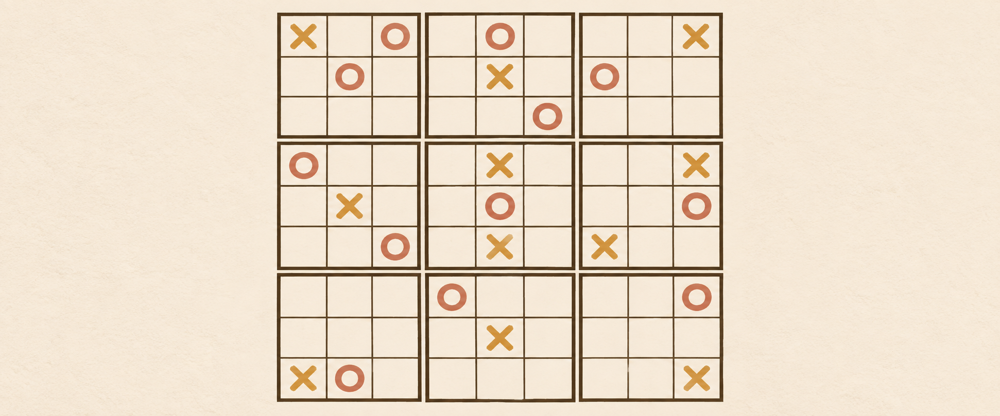
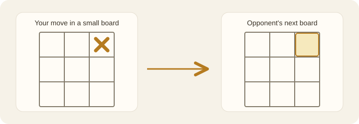

# Ultimate Tic-Tac-Toe AI



Play Ultimate Tic-Tac-Toe against **Sophon v1.1** in your browser. The AI model
is included in this repository: install the Python dependencies, start the
local app, and play.

## Quick start

You'll need Python 3.10 or newer. If you download the repository as a ZIP
instead of using Git, extract it, skip the first two commands, and run the
remaining commands inside the extracted folder.

**Windows (PowerShell)**

```powershell
git clone https://github.com/yunhan-physics/Ultimate-Tic-Tac-Toe-AI.git
cd Ultimate-Tic-Tac-Toe-AI
python -m venv .venv
.\.venv\Scripts\python.exe -m pip install -r requirements.txt
.\.venv\Scripts\python.exe start.py
```

After this first setup, you can double-click `start_web.bat` on Windows.

**macOS / Linux**

```bash
git clone https://github.com/yunhan-physics/Ultimate-Tic-Tac-Toe-AI.git
cd Ultimate-Tic-Tac-Toe-AI
python3 -m venv .venv
.venv/bin/python -m pip install -r requirements.txt
.venv/bin/python start.py
```

The launcher opens your browser at **http://127.0.0.1:8765**. If your browser
doesn't open automatically, visit that address yourself. Running the launcher
again reuses the game server rather than starting a duplicate.

## Play

Choose whether to play first or second, then click a highlighted legal cell.
The **Match** mode is a straightforward game against Sophon. **Guided play**
adds move suggestions and a position estimate when you want to study a move.



The cell you choose inside a small board sends your opponent to the matching
small board on the large board. If that destination is already closed, they may
play in any open small board. A small board closes when someone gets three in a
row or fills it. In this version, the game ends when all nine small boards have
closed; the player who won more small boards wins.

## Useful options

```bash
python start.py --port 8766   # Use another port if 8765 is occupied
python start.py --lan         # Also allow a phone on the same private Wi-Fi
```

For phone play, use the address printed by the launcher. Your computer's
firewall and Wi-Fi settings must allow the connection. The default start is
local-only.

Sophon v1.1 evaluates board rotations and reflections, so its first move may
take a little longer on slower CPUs. The model is already bundled; it does not
need a separate download.

## Project map

- `start.py` — the main launcher; opens the browser game.
- `start_web.bat` — Windows double-click launcher after setup.
- `web/` — browser interface.
- `checkpoints/best.pth` — bundled Sophon v1.1 model.
- `game.py`, `mcts.py`, `model.py`, and supporting modules — game engine and AI.

If startup fails, check `logs/web_server.stderr.log` in your local folder.
This project is released under the [MIT License](LICENSE).
